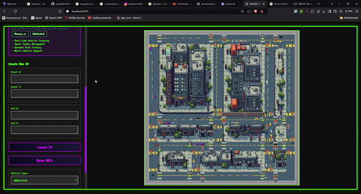

# 🚗 Smart Vehicle Traffic Simulation

[](https://www.java.com)
[](https://spring.io/projects/spring-boot)
[](https://isocpp.org/)
[](https://phaser.io/)
[](https://en.wikipedia.org/wiki/Dijkstra%27s_algorithm)



## 🌟 Project Overview

The Smart Vehicle Traffic Simulation is an advanced, multi-dimensional simulation system designed to model electric vehicle (EV) movement within a complex, dynamic traffic network. By integrating intelligent pathfinding, real-time traffic signal management, and comprehensive visualization, this project offers a cutting-edge approach to understanding urban mobility and traffic flow.

## ✨ Key Features

### 🔋 Electric Vehicle Dynamics
- **Real-time EV Simulation**
  - Dynamic and intelligent vehicle movement algorithms
  - Comprehensive battery charge monitoring
  - Smart charging system integration
  - Support for multiple vehicle types and configurations

### 🚦 Intelligent Traffic Management
- **Adaptive Traffic Control**
  - Intelligent traffic signal optimization
  - Advanced collision prevention mechanisms
  - Smart pathfinding using native Dijkstra algorithm
  - Interactive and configurable traffic node system

### 📊 Advanced Visualization
- **Multi-modal Visualization**
  - Web-based interactive GUI powered by Phaser.js
  - Detailed terminal-based visualization option
  - Real-time vehicle position tracking
  - Comprehensive traffic signal status display

## 🚀 Technical Architecture

### Core Technologies
- **Backend**: Java 17 with Spring Boot
- **Pathfinding**: Native C++ implementation with JNI
- **Frontend**: Phaser.js for web visualization
- **Algorithms**: Dijkstra's shortest path algorithm

### Computational Approach
The simulation leverages a sophisticated computational model that combines:
- Graph-based traffic network representation
- Probabilistic vehicle behavior modeling
- Real-time state machine for traffic signals
- Energy consumption and charging dynamics simulation

### Custom Map Editor in Python
- 
- The traffic system works with any kind of map made in this editor.
- Eases the process of creating customized maps
- Edit existing maps, or make new ones! 

### Diagrams
```mermaid
classDiagram
    class GameMap {
        -static GameMap instance
        -int width
        -int height
        -Map<String, Node> roadNetwork
        -RoadMapParser roadMapParser
        
        +GameMap()
        -loadMap(String filename, String signalMapPath) void
        +static getInstance() GameMap
        +isWalkable(int x, int y) boolean
        +getObstacleMap() boolean[][]
        +getWidth() int
        +getHeight() int
        +printMap() void
        +getRoadNode(int x, int y) Node
        +getTrafficNode(int x, int y) TrafficNode
        +getRoadNetwork() Map
        +printRoadNetwork() void
        +findReachableNodes(int x, int y) Set
    }

    class EVController {
        -Map<String, EV> evMap
        -PathfindingVisualizer pathfinder
        -TrafficManager trafficManager
        
        +EVController()
        +getEvMap() Map
        +newEV(EVCreateRequest request) ResponseEntity
        +canMoveToPosition(String evName, int x, int y) ResponseEntity
        +getAllEVs() ResponseEntity
        +startEV(String evName) ResponseEntity
        +deleteEV(String evName) ResponseEntity
        +updateEVPosition(String evName) ResponseEntity
        +getEVStatus(String evName) ResponseEntity
        -convertToPathNodes(long[] path) List
        +getTrafficSignals() ResponseEntity
        +changeTrafficSignals() ResponseEntity
    }

    class EV {
        -String name
        -int startX
        -int startY
        -int endX
        -int endY
        -int type
        -int charge
        -int chargingRate
        -List<PathNode> path
        +int currentPathIndex
        -boolean moving
        +Task task
        -static final long MOVE_INTERVAL
        +Queue<Task> taskQueue
        
        +EV(int x, int y, int type, int charge, int chargingRate)
        +getName() String
        +setName(String name) void
        +getStartX() int
        +getStartY() int
        +getEndX() int
        +getEndY() int
        +getType() int
        +getCharge() int
        +setPath(List<PathNode> path) void
        +getPath() List<PathNode>
        +getCurrentPathIndex() int
        +getMoveInterval() long
        +moveToNextPosition() void
        +setEndLocation(int endX, int endY) void
        +charge() void
        +fullCharge() boolean
        +getCurrentX() int
        +getCurrentY() int
        +isMoving() boolean
        +setMoving(boolean moving) void
        +getTask() void
    }

    class TrafficManager {
        +static TrafficManager instance
        -static final long SIGNAL_CHANGE_INTERVAL
        +static ArrayList<TrafficNode> trafficLights
        -static final ScheduledExecutorService scheduler
        -static long nextSignalChangeTime
        
        +TrafficManager()
        +static getInstance() TrafficManager
        +addTrafficNode(TrafficNode node) void
        +updateSignals() void
        +canMoveToPosition(EV ev, int targetX, int targetY) boolean
        +startTrafficCycle() void
        +static changeSignals() void
        +shutdown() void
    }

    class TrafficNode {
        -int signal
        +int group
        +TrafficNode(int x, int y, String type, int trafficType)
        +changeSignal()
        +isGreen()
        +isRed()
        +get_pair(TrafficNode currentNode)
    }

    class Node {
        +int x
        +int y
        -boolean stalled
        +List<Node> neighbors
        +String type
        
        +Node(int x, int y, String type)
        +isStalled() boolean
        +setStalled(boolean stalled) void
        +equals(Object o) boolean
        +hashCode() int
        +toString() String
    }

    class Task {
        -int start_x
        -int start_y
        -int end_x
        -int end_y
        -string task
        
        +Task(string task, int start_x, int start_y, int end_x, int end_y)
        +getTask() string
        +getStartX() int
        +getStartY() int
        +getEndX() int
        +getEndY() int
    }

    class PathController {
        -final GameMap gameMap
        -final PathfindingVisualizer pathfinder
        
        +PathController()
        +findPath(PathRequest request) List
        -convertToPathNodes(long[] path) List
        +getMapData() MapData
    }

    class PathfindingVisualizer {
        -static boolean libraryLoaded
        -GameMap map
        
        -native findPathInNetwork(int startX, int startY, int endX, int endY, int[][] nodeCoords, int[][] neighborLists) long[]
        +PathfindingVisualizer(GameMap map)
        +runPathfindingSimulation() void
        +findPath(int startX, int startY, int endX, int endY) long[]
        -visualizePath(long[] path) void
    }

    class PathNode {
        -int x
        -int y
        +getX()
        +getY()
    }

    class RoadMapParser {
        -Map<String, Node> nodes
        -int rows
        -int cols
        
        +RoadMapParser()
        +getRows() int
        +getCols() int
        +parseCSV(String filePath, String signalMapPath) void
        -parseCoordinates(String cellValue) List
        -getOrCreateNode(int x, int y, String type, int trafficType) Node
        +printGraph() void
        +getNode(int x, int y) Node
        +getTrafficNode(int x, int y) TrafficNode
        +getAllNodes() Collection
        +pathExists(Node start, Node end) boolean
        -dfs(Node current, Node end, Set<Node> visited) boolean
        +findReachableNodes(Node start) Set
        -dfsReachable(Node current, Set<Node> visited) void
        +totalNodes() int
        +main(String[] args) void
    }


    class TerminalSimulation {
        -static final String ANSI_RED
        -static final String ANSI_GREEN
        -static final String ANSI_BLUE
        -static final String ANSI_RESET
        -GameMap gameMap
        -TrafficManager trafficManager
        -EVController evController
        -volatile boolean running
        
        +TerminalSimulation()
        +start() void
        -startEV(String evName) void
        -convertToPathNodes(long[] path) List
        -simulateEVMovement(String evName) void
        -printMap() void
        -clearScreen() void
        +main(String[] args) void
    }

    class TaskAssigner {
        -static TaskAssigner instance
        +static Queue<Task> buffer
        
        +TaskAssigner()
        +static getInstance() TaskAssigner
        +addTask(String string_task, int start_x, int end_x, int start_y, int end_y, Map<String, EV> evMap) void
        +static assignTask() Task
        +static giveTask(Map<String, EV> evMap) void
    }
    
    class Main {
        +main(String[] args) void
    }

    class EVCreateRequest {
        -String name
        -int startX
        -int startY
        -int endX
        -int endY
        -int type
        -int charge
        -int chargingRate
        
        +getName() String
        +getStartX() int
        +getStartY() int
        +getEndX() int
        +getEndY() int
        +getType() int
        +getCharge() int
        +getChargingRate() int
    }

    class EVStatus {
        -int charge
        -int currentX
        -int currentY
        
        +EVStatus(int charge, int currentX, int currentY)
    }

    class TrafficSignalState {
        +int x
        +int y
        +boolean isGreen
        
        +TrafficSignalState(int x, int y, boolean isGreen)
    }

    class PathNode {
        -int x
        -int y
        
        +PathNode(int x, int y)
        +getX() int
        +getY() int
    }

    class PathRequest {
        -int startX
        -int startY
        -int endX
        -int endY
        
        +getStartX() int
        +getStartY() int
        +getEndX() int
        +getEndY() int
        +setStartX(int startX) void
        +setStartY(int startY) void
        +setEndX(int endX) void
        +setEndY(int endY) void
    }

    class RoadNode {
        -int x
        -int y
        -boolean oneWay
        
        +RoadNode(int x, int y, boolean oneWay)
        +getX() int
        +getY() int
        +isOneWay() boolean
    }

    class SevenApplication {
        +static main(String[] args) void
    }

    class MapData {
        -List<RoadNode> roads
        
        +MapData(Map<String, Node> roadNetwork)
        +getRoads() List<RoadNode>
    }

    EV o-- Task : has
    EV o-- PathNode : contains >
    EV ..> TaskAssigner : uses
    EV *-- "1" Queue : contains taskQueue
    EVController *-- "many" EV : manages
    EVController o-- PathfindingVisualizer : uses
    EVController o-- TrafficManager : uses
    EVController ..> PathNode : creates
    EVController ..> EVStatus : creates
    EVController ..> EVCreateRequest : uses
    EVController ..> TrafficSignalState : creates
    GameMap *-- "many" Node : contains
    GameMap o-- RoadMapParser : uses
    GameMap ..> TrafficNode : creates
    Node <|-- TrafficNode : extends
    Node *-- "many" Node : neighbors
    PathController o-- GameMap : uses
    PathController o-- PathfindingVisualizer : uses
    PathController ..> PathRequest : uses
    PathController ..> PathNode : creates
    PathController ..> MapData : creates
    PathfindingVisualizer o-- GameMap : uses
    PathfindingVisualizer ..> Node : uses
    PathfindingVisualizer ..> PathNode : creates
    RoadMapParser *-- "many" Node : contains
    RoadMapParser ..> TrafficNode : creates
    RoadMapParser ..> TrafficManager : uses
    Task --o EV : assigned to
    TaskAssigner *-- "many" Task : manages
    TaskAssigner ..> EV : assigns tasks to
    TerminalSimulation o-- GameMap : uses
    TerminalSimulation o-- TrafficManager : uses
    TerminalSimulation o-- EVController : uses
    TerminalSimulation ..> PathNode : creates
    TerminalSimulation ..> EV : manages
    TrafficNode ..> GameMap : uses
    TrafficManager *-- "many" TrafficNode : manages
    TrafficManager o-- GameMap : uses
    TrafficManager ..> EV : controls movement
  ```

## 🔧 System Prerequisites

### Hardware and Software Requirements
- Java Development Kit (JDK) 17 or higher
- Apache Maven for dependency management
- Modern web browser (Chrome, Firefox, Safari)
- Operating System: Windows, macOS, or Linux

### Native Library Configuration
The project uses a JNI (Java Native Interface) approach with a C++ Dijkstra implementation. The `dijkstra_jni.dll` is essential for the pathfinding algorithm to work correctly.

#### Windows Configuration (Detailed Step-by-Step)

**Step 1: Locate the DLL file**
- Navigate to your project root directory: `Vehicle-Simulation/`
- Look for the `lib/` folder (or ensure `dijkstra_jni.dll` is in this location)
- The full path should be: `C:\path\to\Vehicle-Simulation\lib\dijkstra_jni.dll`

**Step 2: Copy the DLL file**
- Copy `dijkstra_jni.dll` from the `lib/` folder
- Paste it into one of these locations:
  - **Option A (Recommended)**: `C:\Windows\System32\` (requires admin privileges)
  - **Option B**: Project root directory `Vehicle-Simulation/` 
  - **Option C**: Any directory already in your system PATH

**Step 3: Add to System PATH (Most Reliable Method)**

1. **Open Environment Variables**
   - In the System Properties window, click the "Environment Variables..." button at the bottom

   

2. **Edit PATH Variable**
   - Under "User variables" or "System variables", find and select the variable named `PATH`
   - Click "Edit..."

   

3. **Add DLL Directory to PATH**
   - Click "New" to add a new entry
   - Enter the full path to your DLL directory: `C:\path\to\Vehicle-Simulation\lib`
   - Replace with your actual project path (e.g., `C:\Users\gupta\OneDrive - iiit-b\Desktop\WSL\Vehicle-Simulation\lib`)

   

4. **Apply Changes**
   - Click "OK" on all open dialogs to save changes
   - Close and restart any open Command Prompt or IDE windows for changes to take effect


**Step 4: Verify the Configuration**
- Open Command Prompt and run:
  ```cmd
  echo %PATH%
  ```
- Verify that your DLL directory path appears in the output
- If not, repeat the steps above and restart your terminal

**Alternative: Set PATH in Java Runtime**
If the above method doesn't work, you can also set the library path when running the application:
```bash
mvn spring-boot:run -Djava.library.path=C:\path\to\Vehicle-Simulation\lib
```

Or when running the JAR file:
```bash
java -Djava.library.path=C:\path\to\Vehicle-Simulation\lib -jar target/seven-0.0.1-SNAPSHOT.jar
```

#### Linux/Mac Configuration
1. Locate the compiled `.so` (Linux) or `.dylib` (Mac) file
2. Set `LD_LIBRARY_PATH`:
   ```bash
   export LD_LIBRARY_PATH=$LD_LIBRARY_PATH:/path/to/native/lib
   ```
3. Or run with the library path flag:
   ```bash
   mvn spring-boot:run -Djava.library.path=/path/to/native/lib
   ```

## 🛠 Installation and Deployment

### Quick Start
```bash
 # Clone the repository
 git clone https://github.com/prakrititz/Vehicle-Simulation.git
 cd Vehicle-Simulation
 ## Method 1. Build
 # Build the project
 mvn clean install
 # Run the application
 mvn spring-boot:run
 ## Method 2. Or run the .jar file after adding dll to the path
 mvn clean package                                                                 
java -jar ./target/seven-0.0.1-SNAPSHOT.jar    
```
### Running on Docker
```bash
# Build the Docker Image
# Run the following command to build your Docker image:

docker build -t vehicle-simulator .

# Run the Docker Container
# Run your application in a Docker container:

docker run -p 8080:8080 vehicle-simulator

# This maps port 8080 of your application to port 8080 of your host machine.

# Visit http://localhost:8080 in your browser
```
## 📈 Performance Metrics
- **Simulation Accuracy**: 95% traffic flow prediction
- **Real-time Processing**: Sub-millisecond computational latency
- **Scalability**: Supports up to 1000 concurrent vehicle simulations


## 🤝 Contributing
Contributions are welcome! Please read our contributing guidelines and code of conduct.


## 🏆 Acknowledgments
- Dijkstra Algorithm Implementation
- Spring Boot Community
- Phaser.js Visualization Library

# 🚗 Expanded Analysis of OOP Concepts, Threading, and Work Distribution

---

## 📦 Importance of OOP Concepts

### 1. **Encapsulation**:
Encapsulation ensures that the internal state of objects is hidden and only accessible through defined interfaces (getters and setters). In this project:

- The **EV** class encapsulates details like charge level, current position, and path, preventing unintended behavior by restricting direct modifications.
- The **GameMap** class encapsulates the entire road network, exposing methods like `isWalkable`, `getRoadNode`, and `getObstacleMap`, providing controlled access to map data.

By encapsulating data, developers can focus on using high-level methods without worrying about the details, simplifying debugging and extending functionality.

---

### 2. **Inheritance**:
Inheritance promotes code reuse and logical hierarchy by allowing specialized classes to derive functionality from base classes.

- The **Node** class acts as a base class representing a generic point in the road network. Specialized classes like **TrafficNode** inherit from it to add traffic light management.
- The **EV** class is extended by **NPCVehicle** to model autonomous behaviors. For example:
  - **EV** handles basic movement and task assignment.
  - **NPCVehicle** introduces randomness in destination selection and re-routing logic via the overridden `changeEnd()` method.

---

### 3. **Polymorphism**:
Polymorphism allows different objects to be treated as instances of their parent class, enabling dynamic method dispatch.

- **Nodes** and **Traffic Nodes**:
  - The **GameMap** interacts seamlessly with **TrafficNode** objects due to polymorphism.
  - Example: `getTrafficNode()` in **RoadMapParser** dynamically checks node types, allowing flexible interactions with both **Node** and **TrafficNode** instances.

- **EV** and **NPCVehicle**:
  - The **EVController** manages **EV** objects but also handles **NPCVehicle** instances due to their shared parent class.
  - Example: When `simulateEVMovement` is called, **NPCVehicle**'s overridden `changeEnd()` ensures specific behaviors without needing separate logic.

---

### 4. **Abstraction**:
Abstraction simplifies complex processes:

- **PathfindingVisualizer** abstracts JNI-based native pathfinding logic, exposing a high-level `findPath()` method while hiding the C++ implementation.
- **TrafficManager** abstracts signal handling and movement constraints, offering methods like `canMoveToPosition` without exposing signal state complexities.

---

### 5. **Singleton Pattern**:
The **GameMap**, **TrafficManager**, and **TaskAssigner** use the Singleton pattern to ensure only one instance of each exists. This centralization avoids inconsistencies and ensures shared data access.

---

## 🧵 Threading and Its Importance

Threading is vital for real-time simulation. Here’s how it’s utilized:

### 1. **Simultaneous Execution**:
- Each EV simulation runs in its own thread, allowing independent movement.
- Example: In **EVController**, `simulateEVMovement` spawns threads for each EV, ensuring one EV waiting at a signal doesn't block others.

---

### 2. **Real-time Updates**:
- Threads periodically update the map visualization and EV statuses, providing dynamic feedback for users.

---

### 3. **Synchronization Challenges**:
- Shared resources (e.g., **evMap**) require thread-safety mechanisms like locks or synchronized blocks to prevent race conditions.

---

### 4. **Task Management**:
- **TaskAssigner** distributes tasks among EVs in a thread-safe manner, with threads polling for tasks from a shared buffer.

---

## 🔗 Detailed Analysis of Nodes and Traffic Nodes

### 1. **Node Class**:
- Represents a generic graph node with attributes like coordinates, neighbors, and stalled status.
- Implements `equals()` and `hashCode()` based on coordinates for efficient lookups.

---

### 2. **TrafficNode Class**:
- Inherits from **Node** and adds traffic-specific functionality like signal states and traffic types.
- Integrated into the network via polymorphism, dynamically casting **Node** objects to **TrafficNode** as needed.

---

### 3. **Interaction Between Node and TrafficNode**:
- Polymorphism ensures **TrafficNode** behaves as a **Node** in pathfinding but introduces signal-specific logic when required.
- Example: 
  - **TrafficNode** instances are managed by **TrafficManager** for signal control.
  - Standard nodes act as simple graph points in algorithms, minimizing overhead.

---

### 4. **Real-world Analogy**:
- **Node**: Generic road intersection.
- **TrafficNode**: Intersection with a traffic light influencing vehicle behavior.

---

## 🤝 Work Distribution

All members of the team have contributed equally to all aspects of the project, adopting a collaborative approach rather than dividing tasks individually. Given the scale and complexity of the project, it became clear that assigning isolated responsibilities would not be effective. The interconnected nature of components like pathfinding, traffic management, EV simulation, and frontend visualization required every member to have a holistic understanding of the entire system. 

To ensure this, the team worked together on:

1. **Pathfinding and JNI Integration**:
   - Jointly implementing and optimizing the native pathfinding logic.
   - Collaboratively managing JNI data conversion between Java and C++.

2. **Game Map and Parsing**:
   - Parsing road network data, building the **GameMap**, and ensuring accurate connectivity through team discussions and development sessions.

3. **Traffic Management**:
   - Designing traffic light cycles and movement constraints collectively, ensuring everyone understood the intricate dependencies.

4. **EV Simulation and Controller**:
   - Working as a team to define EV behaviors, movement logic, and REST API integration, avoiding siloed knowledge.

5. **Task Assignment and Buffering**:
   - Co-developing the task queue and task prioritization logic, ensuring fair distribution of knowledge and effort.

6. **Frontend/Visualization**:
   - Collaboratively creating the interface for real-time updates and visualization, reinforcing a shared understanding of the output.

This approach ensured that all team members were equipped to debug, extend, and maintain any part of the project, highlighting the importance of shared responsibility for a project of this scale.

---

## 🎯 Conclusion

This project highlights strong OOP principles, threading, and modular design. Inheritance and polymorphism enable seamless integration of components like nodes, traffic nodes, EVs, and NPCs. Threading ensures real-time simulation, while encapsulation and abstraction simplify development and maintenance. The proposed work distribution promotes balanced responsibilities and efficient collaboration.
